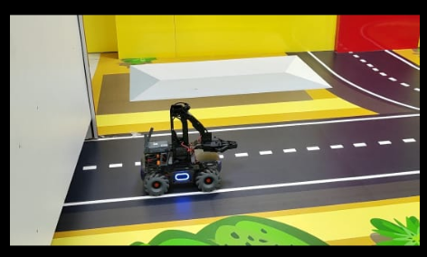
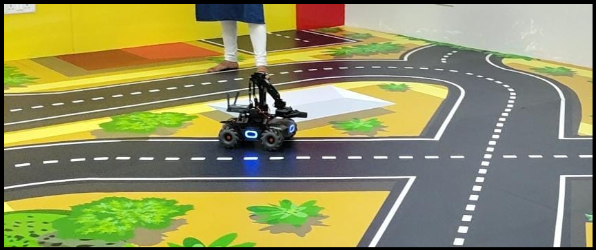

# MobileRobot-Openloopcontrol
## Aim:

To develop a python control code to move the mobilerobot along the predefined path.

## Equipments Required:
1. RoboMaster EP core
2. Python 3.7

## Procedure

# Step1:
Initiate the MobileRobot.
<br/>

# Step2:
Connect your PC with the MobileRobot.
<br/>

# Step3:
Open Python program.
<br/>

# Step4:
Program the movements of the robot using python code.
<br/>

# Step5:
Execute the python program.
<br/>

## Program
```python
Python control code to move the mobilerobot along the predefined path.
Developed by:Yogeshvar.M
Register No.: 22003358
from robomaster import robot
import time
from robomaster import camera


if _name_ == '_main_':
    ep_robot = robot.Robot()
    ep_robot.initialize(conn_type="ap")

    ep_led = ep_robot.led

for i in range(10):
    ep_led.set_led(comp="all",r=255,g=0,b=0,effect="on")   
    time.sleep(2)

    ep_led.set_led(comp="all",r=0,g=255,b=100,effect="on")   
    time.sleep(2)

    ep_led.set_led(comp="all",r=0,g=0,b=255,effect="on")   
    time.sleep(2)

    ep_chassis = ep_robot.chassis 

    ep_camera = ep_robot.camera

    print("Camera streaming started...")
    ep_camera.start_video_stream(display=True,resolution=camera.STREAM_360P)    
    ep_camera = ep_robot.camera   
    
 
    ep_chassis.move(x=3.9, y=0, z=0, xy_speed=0.75).wait_for_completed()

    ep_chassis.drive_speed(x=0.2,y=0,z=20)
    time.sleep(7)

    ep_chassis.move(x=2.5, y=0, z=0, xy_speed=0.75).wait_for_completed()

    ep_chassis.move(x=0, y=0.1, z=0, xy_speed=0.75).wait_for_completed()

    ep_chassis.drive_speed(x=1,y=0,z=40)
    time.sleep(7)

    ep_chassis.move(x=0, y=0.1, z=0, xy_speed=0.75).wait_for_completed()

    ep_camera.stop_video_stream()
    print("Stopped video streaming...")

    
    ep_robot.close()
```

## MobileRobot Movement Image:


## Starting point


## End point


## MobileRobot Movement Video:

Upload your video in Youtube and paste your video-id here

https://youtu.be/JXPdApFe0og


## Result:
Thus the python program code is developed to move the mobilerobot in the predefined path.

```
Mobile Robotics Laboratory
Department of Artificial Intelligence and Data Science/ Machine Learning
Saveetha Engineering College
```
